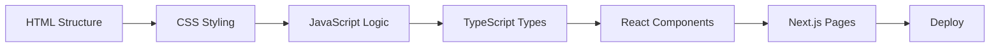

# Web Development Fundamentals

Web development encompasses the creation of websites and web applications that run in browsers. As an intern starting your career, building a strong foundation in the core technologies will enable you to understand and contribute to any web project, regardless of the frameworks or tools used.

This section covers the essential building blocks of modern web development, from the fundamental trio of HTML, CSS, and JavaScript to modern frameworks like React and Next.js, and the type-safety benefits of TypeScript.

## Learning Path Overview

We've structured this curriculum to build your skills progressively:

### 🌱 Fundamentals (Start Here)

| Topic | Description | Estimated Time |
|-------|-------------|----------------|
| [HTML](/docs/web-fundamentals/html) | Semantic markup, forms, accessibility, and modern HTML5 features | 20 min |
| [CSS](/docs/web-fundamentals/css) | Selectors, box model, Flexbox, Grid, animations, responsive design | 25 min |
| [JavaScript](/docs/web-fundamentals/javascript) | Variables, functions, async programming, DOM manipulation, ES6+ | 30 min |

### 🚀 Modern Frameworks & Tools

| Topic | Description | Estimated Time |
|-------|-------------|----------------|
| [TypeScript Fundamentals](/docs/web-fundamentals/typescript-fundamentals) | Type annotations, interfaces, generics, utility types | 25 min |
| [React Basics](/docs/web-fundamentals/react-basics) | Components, hooks, state management, context patterns | 25 min |
| [Next.js App Router](/docs/frontend-architecture/nextjs) | Server components, server actions, streaming, caching | 30 min |
| [Node.js Environment Variables](/docs/backend-database/nodejs-env-variables) | Secure configuration management with `.env` files | 15 min |

## How to Use This Guide

Each topic follows a consistent structure designed for effective learning:

1. **Introduction** – Context and why the topic matters
2. **Key Concepts** – Core concepts explained with production-ready code examples
3. **Full Example** – A complete, runnable implementation showing real-world usage
4. **Common Mistakes** – Anti-patterns to avoid with corrected alternatives
5. **Exercises** – Hands-on practice tasks to reinforce learning
6. **Sources** – Official documentation and trusted resources for deeper study

## Prerequisites

Before diving in, ensure you have:
- A code editor (VS Code recommended)
- Node.js 20+ installed
- Basic command line familiarity
- Git for version control

## Getting Started

1. **Clone the practice repository** to follow along with exercises:
   ```bash
   git clone https://github.com/your-org/intern-practice.git
   cd intern-practice
   npm install
   ```

2. **Start with HTML** – It's the foundation everything else builds upon

3. **Complete exercises** – Don't just read; write code. The exercises are designed to be run locally

4. **Experiment** – Modify the examples, break them, fix them. That's how you learn

## Modern Web Development Workflow



## Key Principles for Interns

### Write Code for Humans First
> "Any fool can write code that a computer can understand. Good programmers write code that humans can understand." – Martin Fowler

- Use meaningful variable and function names
- Write self-documenting code with clear structure
- Add comments for *why*, not *what*

### Embrace the Browser DevTools
- **Elements tab**: Inspect and debug HTML/CSS
- **Console tab**: Test JavaScript, see errors
- **Network tab**: Monitor API requests
- **Application tab**: Check localStorage, cookies, service workers
- **Performance tab**: Profile runtime performance

### Learn to Read Documentation
Official docs are your best reference:
- [MDN Web Docs](https://developer.mozilla.org/) – Comprehensive web standards reference
- [React Documentation](https://react.dev/) – Official React guides
- [Next.js Documentation](https://nextjs.org/docs) – Framework-specific guides
- [TypeScript Handbook](https://www.typescriptlang.org/docs/) – Language reference

### Practice Incremental Development
1. Start with a minimal working version
2. Test each change before adding the next
3. Commit frequently with clear messages
4. Refactor when patterns emerge

## Next Steps

Begin with [HTML Fundamentals](/docs/web-development/html) to build your semantic markup foundation. Each topic builds on the previous ones, so we recommend following the order above.

---

## Further Reading

- [Web.dev Learn](https://web.dev/learn/) – Google's structured web development courses
- [Frontend Mentor](https://www.frontendmentor.io/) – Real-world HTML/CSS/JS challenges
- [CSS-Tricks](https://css-tricks.com/) – Practical CSS techniques and guides
- [JavaScript Weekly](https://javascriptweekly.com/) – Curated JavaScript news and articles